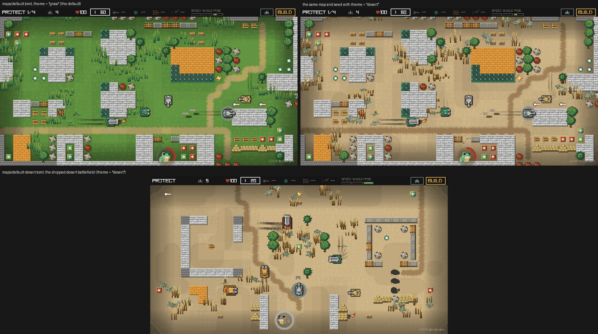

# Themes — the grass and desert battlefields

A map's `theme` key picks its look: `grass` (the default, and what every
older file gets) or `desert` — pale dust in place of the grass floor, dry
scrub in place of the green tufts, soft hardpan drifts across the open
ground. Purely presentational: the simulation, the nav grid and the linter
never read it, so two maps that differ only in theme play identically.



## The attribute

- **Map file**: a top-level `theme = "desert"` (`map::Theme`, TOML
  `lowercase`). Absent means `grass`, and grass is not written back, so an
  editor re-save of an older map is byte-identical. An unknown name is a
  parse error, not a fallback.
- **Builder**: the MAP panel's THEME row cycles `Theme::ALL`; the canvas
  redraws in the new theme at once (`apply_settings` rebuilds the ground),
  and the change is one undo step like every other settings field.
- **Dev server**: `builder_settings {theme: "desert"}` (null = grass);
  `status`/`map_get` report the round's `map.theme`.
- **Shipped**: `maps/default-desert.toml` is in `SHIPPED_MAPS`, so the web
  build lists it too, and `maplint` holds it to zero errors like
  `default.toml`.
- **Adding a theme** (ice is the obvious next one): one `Theme` variant
  with its two asset paths, one curve/table in `tools/retint_ground.py`,
  one species set in `tools/spritegen/gen_grass.py`, a line in
  `tools/check_sheets.py`. Nothing else in Rust names a theme.

## How a theme is drawn

Every theme's two sheets ship in every build and are loaded up front;
`app.rs` picks the pair by the live map each frame (`Theme::ground_texture_path`,
`Theme::grass_texture_path`), for the round and for the builder's canvas.

- **The floor** (`tools/retint_ground.py`, `static/punyworld/`). Both live
  tilesets are retinted copies of the pristine Puny World original, one
  file per theme. `grass` is the de-green pass (`#85A643` → `#619541`,
  dirt to earth-tan). `desert` turns the grass fill into pale, pebbly dust
  (`#85A643` → `#CCB385`), the dirt paths into a darker packed-earth road
  (`#C4B253` → `#A08058`) and the pack's sand into a slightly darker,
  smoother hardpan (`#C9B266` → `#C2A87D`). The colours the game actually
  draws go through an exact table, the rest of the sheet through the hue
  curve — `docs/GROUND_SPEC.md` §1 has the reasoning (the pack's sand and
  dirt share their edge-dither pixels, so a curve alone cannot separate
  them).
- **Drift patches** (`src/ground.rs`, `docs/GROUND_SPEC.md` §8). Only on a
  theme whose `Theme::drifts` says so (the desert): soft blobs of the
  pack's sand tiles over the open floor, laid at the grid vertices by a
  hashed value noise and resolved through the pack's own sand-against-grass
  corner autotile, so every edge is hand-painted. Never beside a road cell.
  Two `cosmetics` knobs, both `@ Restart`: `ground_drift_cover` (fraction
  of the open floor, 0 turns them off) and `ground_drift_scale` (noise
  pitch in cells). Both are in the PR preview's tuning panel.
- **The tall grass** (`tools/spritegen/gen_grass.py`, one sheet per theme).
  The desert sheet carries three species on the same 3 × 8 layout: bleached
  bunchgrass fountaining out of a dark root (one blade in eight still
  green), tall stalks carrying seed heads, and a low sagebrush clump — grey
  body, green speckle, dark twigs. Dark khaki silhouettes with pale tips,
  because the pale SAND_* steps sit right on the dust's value and straw
  drawn in straw colour vanishes against it. Both sheets are on
  `PUNY_PALETTE_ALL` (`just check-sheets`); crush, sway, wake, burn and
  concealment are untouched, since only the sheet differs.
- **Rustle flecks** (`src/fx.rs`). A hull crossing tall grass kicks up leaf
  green on the grass theme and straw (`STRAW_*`, the tuft's own SAND_*
  steps) on the desert. Trees keep `LEAF_*` on both.

## The shipped desert map

`maps/default-desert.toml` (its header comments describe every feature):
a Protect round on the band plan with five tanks and the scout. Two
caravan tracks off the north edge; an oasis of reeds between tree clumps
with the frog health pack in the middle; a ruined fort in the west with
iron towers, three-cell breaches and the minigun in its yard; a fuel depot
in the east — four pinned fuel drums round the plasma pickup, an oil trail
out of the gate to a sandbag berm hiding a fifth drum, so one shot into the
yard blows the berm; the frog's shrine at the bottom between two brick
piers. Every lane is two nav cells wide: the nav grid pads a solid cell one
cell to its left and above, so obstacles stand three free cells apart and
each breach is three cells wide.

## Deliberately not changed

- **Trees** stay green on the desert: on dust they read as an oasis grove.
  Palms and saguaros would be a sheet of their own (`gen_trees.py`, 48 px
  cells) and a bigger pass.
- **Sandbags** lose some contrast against dust (sand on sand); their
  outline and front strip still carry them. Worth a look if the theme
  sticks.

## Regenerating

```sh
python3 tools/retint_ground.py                         # both tilesets (BONGBONG_THEME=x for one)
SPRITE_OUT=static python3 tools/spritegen/gen_grass.py # both grass sheets
python3 tools/check_sheets.py
```
