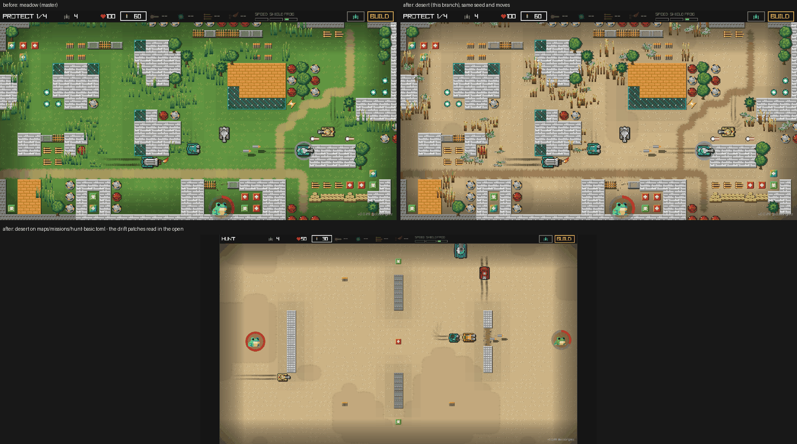
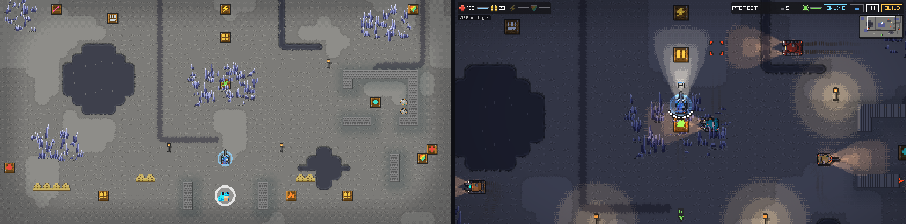

# Themes — the grass, desert and moon battlefields

A map's `theme` key picks its look: `grass` (the default, and what every
older file gets) or `desert` — pale dust in place of the grass floor, dry
scrub in place of the green tufts, soft hardpan drifts across the open
ground - or `moon` - grey regolith under a black sky, crater chasms
and crystal shards (below, "The moon"). Purely presentational: the simulation, the nav grid and the linter
never read it, so two maps that differ only in theme play identically.



## The attribute

- **Map file**: a top-level `theme = "desert"` (`map::Theme`, TOML
  `lowercase`). Absent means `grass`, and grass is not written back, so an
  editor re-save of an older map is byte-identical. An unknown name is a
  parse error, not a fallback.
- **Builder**: the MAP panel's THEME row cycles `Theme::ALL`; the canvas
  redraws in the new theme at once (`apply_settings` rebuilds the ground),
  and the change is one undo step like every other settings field.
- **Dev server**: `builder_settings {theme: "desert"}` (null = grass);
  `status`/`map_get` report the round's `map.theme`.
- **Shipped**: `maps/default-desert.toml` is in `SHIPPED_MAPS`, so the web
  build lists it too, and `maplint` holds it to zero errors like
  `default.toml`; `maps/moon-base.toml` is the moon's.
- **Adding a theme** (ice is the obvious next one): one `Theme` variant
  with its two asset paths, one curve/table in `tools/retint_ground.py`,
  one species set in `tools/spritegen/gen_grass.py`, a line in
  `tools/check_sheets.py`, and the few presentation matches the compiler
  points at (`fx.rs`'s rustle flecks, `ground::edge_shade_color`, the
  minimap's floor classes, the `theme-` message in each language).

## How a theme is drawn

Every theme's two sheets ship in every build and are loaded up front;
`app.rs` picks the pair by the live map each frame (`Theme::ground_texture_path`,
`Theme::grass_texture_path`), for the round and for the builder's canvas.

- **The floor** (`tools/retint_ground.py`, `static/punyworld/`). Both live
  tilesets are retinted copies of the pristine Puny World original, one
  file per theme. `grass` is the de-green pass (`#85A643` → `#619541`,
  dirt to earth-tan). `desert` turns the grass fill into pale, pebbly dust
  (`#85A643` → `#CCB385`), the dirt paths into a darker packed-earth road
  (`#C4B253` → `#A08058`) and the pack's sand into a slightly darker,
  smoother hardpan (`#C9B266` → `#C2A87D`). The colours the game actually
  draws go through an exact table, the rest of the sheet through the hue
  curve — `docs/GROUND_SPEC.md` §1 has the reasoning (the pack's sand and
  dirt share their edge-dither pixels, so a curve alone cannot separate
  them).
- **Drift patches** (`src/ground.rs`, `docs/GROUND_SPEC.md` §8). Only on a
  theme whose `Theme::drifts` says so (the desert): soft blobs of the
  pack's sand tiles over the open floor, laid at the grid vertices by a
  hashed value noise and resolved through the pack's own sand-against-grass
  corner autotile, so every edge is hand-painted. Never beside a road cell.
  Two `cosmetics` knobs, both `@ Restart`: `ground_drift_cover` (fraction
  of the open floor, 0 turns them off) and `ground_drift_scale` (noise
  pitch in cells). Both are in the PR preview's tuning panel.
- **The tall grass** (`tools/spritegen/gen_grass.py`, one sheet per theme).
  The desert sheet carries three species on the same 3 × 8 layout: bleached
  bunchgrass fountaining out of a dark root (one blade in eight still
  green), tall stalks carrying seed heads, and a low sagebrush clump — grey
  body, green speckle, dark twigs. Dark khaki silhouettes with pale tips,
  because the pale SAND_* steps sit right on the dust's value and straw
  drawn in straw colour vanishes against it. Both sheets are on
  `PUNY_PALETTE_ALL` (`just check-sheets`); crush, sway, wake, burn and
  concealment are untouched, since only the sheet differs.
- **Rustle flecks** (`src/fx.rs`). A hull crossing tall grass kicks up leaf
  green on the grass theme and straw (`STRAW_*`, the tuft's own SAND_*
  steps) on the desert. Trees keep `LEAF_*` on both.

## The shipped desert map

`maps/default-desert.toml` (its header comments describe every feature):
a Protect round on the band plan with five tanks and the scout. Two
caravan tracks off the north edge; an oasis of reeds between tree clumps
with the frog health pack in the middle; a ruined fort in the west with
iron towers, three-cell breaches and the minigun in its yard; a fuel depot
in the east — four pinned fuel drums round the plasma pickup, an oil trail
out of the gate to a sandbag berm hiding a fifth drum, so one shot into the
yard blows the berm; the frog's shrine at the bottom between two brick
piers. Every lane is two nav cells wide: the nav grid pads a solid cell one
cell to its left and above, so obstacles stand three free cells apart and
each breach is three cells wide.

## The moon



`theme = "moon"` (BB-24). Every cosmetic layer that would read as Earth is
turned to the moon; every rule is the one the cell already had, so a map
plays the same on any theme.

- **The floor** (`retint_ground.py`'s `moon` entry): the grass fill turns
  to grey regolith (`#7C7B78`, its specks grains and pebbles), the dirt
  paths to dark compacted basalt (`#545359`, rover tracks), the sand to a
  lighter ejecta dust that drifts across the open like crater rays
  (`Theme::drifts`), and every water tile to a dark blue-violet chasm.
  Wood and roofs are untouched, as on the desert. The field's edge
  deepens to the vacuum's near-black (`ground::edge_shade_color`).
- **Water is a chasm and a dust channel.** Deep water already blocks a
  hull and lets a shot fly over, which is a crater pit; a ford already
  slows and loosens a hull, which is a channel of loose dust. So the cells
  keep water's rules and lose water's dressing (`Theme::liquid` is false):
  no fish (`fish::Shoal`), regolith thrown up where spray would be
  (`fx.rs`'s `splash`), and the current's marks drawn as faint dust
  (`ground::DUST_FLOW_MARK`). The minimap draws fords and chasms in the
  dust's dark greys. Snow still freezes them: the weather's rules come
  first.
- **Crystal shards** for tall grass (`gen_grass.py`'s `draw_crystal`,
  `nature_sheet_moon.png`): a cluster fanning out of a rubble base, tall
  twin spires, a low geode clump of pebbles with crystal points; faceted
  with a lit left face, a shaded right one and a pale tip, in
  `punypalette.CRYSTAL` - a cold violet-blue the terrain never uses, off
  the palette on purpose and admitted on that sheet alone. Each tuft is
  clipped to `grass::TUFT_EXTENTS` (read from the Rust source), so a new
  sheet never widens the table the other themes' grass is placed by.
  Concealment, crush, sway and burn are the grass's. A hull kicks up
  crystal chips (`fx.rs`'s `CRYSTAL_*`).
- **The lunar sky** (`weather = "lunar"`, docs/weather.md): dark and cool,
  every light at full - headlights, lamp posts, fires and muzzle flashes
  carry the picture. Looks only: enemies see as far and hulls grip as
  well as under a clear sky. A moon map names it; the theme does not
  force it, so a moon map can still be played in daylight or at night.
- **Kept as they are, for now**: walls (the orange brick and teal glass
  stand out on grey - a regolith-block and habitat-panel set is the next
  pass, so moon maps lean on iron and sandbags), trees (green, so
  `moon-base` has none; a rock-spire sheet is the next pass), the frog
  (a helmet overlay was sketched, not drawn).

`maps/moon-base.toml` (its header describes it): Protect, band plan, five
tanks, the scout. The Mare crater fills the west, a rille comes in off the
north edge, a crystal field holds the frog health pack in the open centre,
an iron outpost with two fuel drums and the plasma pickup stands in the
east, and the habitat at the bottom has two iron piers round the frog and
lamp posts lighting the start. It lints to zero errors like the desert's.

## Deliberately not changed

- **Trees** stay green on the desert: on dust they read as an oasis grove.
  Palms and saguaros would be a sheet of their own (`gen_trees.py`, 48 px
  cells) and a bigger pass.
- **Sandbags** lose some contrast against dust (sand on sand); their
  outline and front strip still carry them. Worth a look if the theme
  sticks.

## Regenerating

```sh
python3 tools/retint_ground.py                         # every tileset (BONGBONG_THEME=x for one)
SPRITE_OUT=static python3 tools/spritegen/gen_grass.py # every grass sheet
python3 tools/check_sheets.py
```
