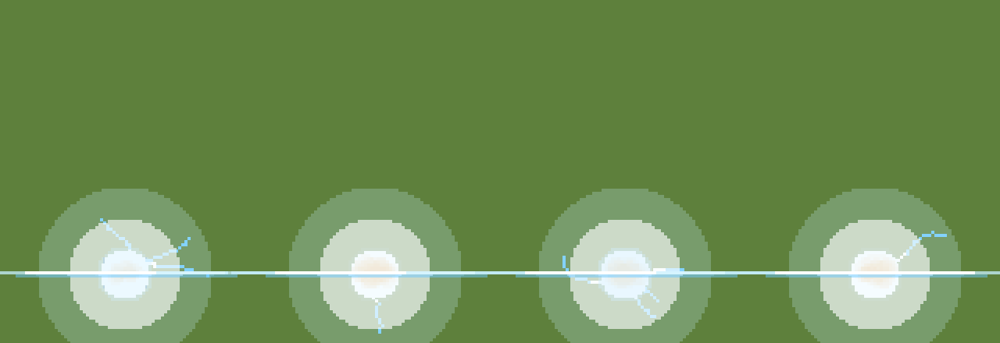

# Mushroom cloud

A dying tank goes up in a mushroom cloud in `wreck_mushroom_chance` (0.7)
of kills; the rest get the sheet's reference fireball (`blast::BlastFx::new`).
The pick is a salted hash of the kill position (`BlastFx::wreck`), so no
RNG is drawn and a seeded replay is unchanged. Barrels never use it.

## Composed, not baked

`mushroom.rs` builds the cloud at draw time from puffs, discs of whole
2 px blocks with a one-block darker rim. Nothing comes from a sprite sheet.
Time is continuous, so it moves every frame instead of stepping through
twelve cells. `Cloud::compose(base, time)` is a pure function returning
the layers to paint back to front; `mushroom::draw` paints them through a
`Canvas` (the game's `GpuCanvas`, or a `CpuCanvas` headless). Each layer
is rimmed as a whole before it is filled, so its puffs merge into one
outlined mass while the layers stay distinct.

| Layer | What it does |
|---|---|
| flash | white disc with a gold rim and eight block rays, ~0.09 s |
| dust skirt | a ring of pale puffs racing out along the ground at the view's tilt (`squash`), split into a back half (under the stem) and a front half (over it) |
| stem | puffs riding up a conveyor from the hull to the cap, flared at the foot, waisted in the middle, wobbling; stays hot longest at the bottom, then breaks up bottom-first |
| cap | a ring of puffs rolling over itself like a smoke ring (out over the top, down the outside, back in underneath), sorted by depth; the underside keeps its fire longest, the top cools first toward pale ash |
| dome | a few puffs bulging out of the ring's middle |
| embers | blocks thrown up and out, falling back |

Colours are the palette's fire steps (white, gold, reds) and stone greys
(docs/PALETTE.md). A puff's heat falls with time and turns it to smoke,
which then pales. Puffs dissolve by shrinking at hashed moments, with no
alpha, so overlaps never blotch.

## Variation

`Cloud::new(seed, scale)` hashes the life, height, cap size, lean, roll
speed, stem width and flow, and the puff counts for the cap, dome, skirt
and embers from the blast's seed. Every puff then hashes its own place,
size, cooling and dissolve time. Knobs: `mushroom_seconds`,
`mushroom_height_px`, `mushroom_cap_px` (each jittered per kill).

## Preview

`cargo test --lib mushroom::tests::preview -- --ignored` writes
`target/mushroom_preview.png` (six clouds over their life) and
`target/mushroom_frames/*.png` (four clouds at 30 fps, for a GIF).
