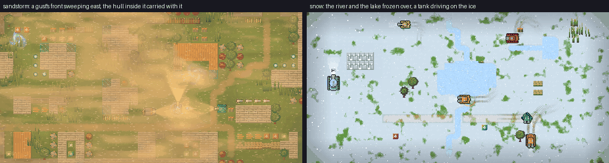

# Weather — the sky over the battlefield

A map's `weather` key names the skies it may be fought under: `clear`
(the default, and what every older file gets), `night`, `dusk`, `rain`,
`storm`, `fog`, `sandstorm`, `snow` or `heat_haze` - one of them, a list
of several (`["rain", "snow"]`), of which each round's seed picks one, or
`random`, every sky. A sky is drawn and it changes the rules (below): enemies see
less at night and in fog, hulls lose grip in the rain, snow freezes the
water into ice a tank drives across, and a sandstorm's gusts carry every
hull downwind. `Game::init` settles the round's sky once, from the map's
key and the round seed, and every rule is a pure function of it, the
knobs and the round clock - no RNG - so a seeded replay replays under its
sky, and a clear sky plays exactly as a round with no weather at all (the
probe and the determinism pins hold it to that).

## The attribute

- **Map file**: a top-level `weather = "night"` or `weather = ["night",
  "rain"]` (`map::Skies`, a set over `Weather::SKIES`; the names are
  `map::Weather`'s, TOML `snake_case`). Absent, `[]` or `"clear"` alone
  mean clear, which is not written back; one sky is written as its name,
  every sky as `"random"`, and any other set as a list in `SKIES` order,
  so an editor re-save of a map with one sky or none is byte-identical and
  keeps its clear stamp's revision. `clear` may be one of several
  (`["clear", "rain"]`: a dry round or a wet one). An unknown name is a
  parse error, not a fallback.
- **Builder**: the MAP panel's SKY group is a tile per sky, ringed and
  ticked while the map holds it: a tap puts the sky in or takes it out,
  one undo step like every other settings field. With none in, the map is
  clear and CLEAR shows ticked. The canvas stays clear, since a map is
  edited in daylight; PLAY starts the round under the sky its seed picks.
- **The pick**: a round takes one of its map's skies, every one as likely
  as the others, by `weather::pick_sky`, a hash of the round's seed;
  `random` is the pick over all of `Weather::SKIES` (`random_sky`). It is not a draw from
  the round's RNG, so the stream is untouched and every seeded replay and
  probe fixture is the same under it, and it is not the wall clock: the
  same seed always brings the same sky - `--seed`, the dev server's
  `restart {seed}` and a room's `Welcome`, whose seed every replica is
  initialised on (a rematch's `RoundStarted` moves them all to the next
  one together). An unpinned round draws a fresh seed, so a fresh sky.
  `Game::weather()` is never `Random` and always one of the map's skies;
  the key stays as written on disk, in the builder and in `map_get`.
- **Over every local round**: the `weather_override` knob (`weather`
  tuning group) takes a weather's index in `Weather::ALL`, `-1` following
  the map and 9 a random sky for every round. It is a `Restart` row: a sky
  is settled when a round starts, so a change shows from the next one.
  `--weather night` (or `--weather random`) stages it at startup the way
  `--zoom` stages `view_max_scale`, the web build reads `?weather=night`
  off its page (`weather::weather_from_url`, through `window.bbInvite`),
  and on a PR preview it is a row in the tuning panel. The builder's row
  SKY group shows `(cli)` while it is set.
- **Dev server**: `weather` reports the round's sky (`in_force`, the
  seed's pick by name), the map's own key (a name, or the list), the override's pick, every name
  and the `rules` in force (`on`, `enemy_sight_px`, `grip`, `frozen`,
  `gust_on_player` - player 1's wind, px/s - and `gust_front`, the gust
  crossing the field) and `without_shaders` (the window draws its skies
  plainly, "Without shaders" below); with `name` - a weather or a list of
  them - it puts that key on the round's map and changes the sky
  mid-round, or with `restart: true` starts the round over on its own
  seed, frozen in lockstep like `restart`. `status.weather`,
  `map.weather`, `builder_settings {weather}` (a name or a list; null or
  `[]` = clear) and `map_get`/`restart {map_toml}` carry the key too.
- **Online**: a room's round is fought under its map's sky alone
  (`Game::weather_from_map`): the key rides the map TOML every `Welcome`
  carries and the seed rides the same message, so every replica and every
  prediction sandbox is built under the room's sky - its ice where the
  room's is, its enemies' sight the room's - with nothing new on the wire
  and `PROTOCOL_VERSION` unchanged. The window's override knob never
  reaches a room's round; the rig, standing in for a room, bakes it into
  the room's map key instead, so `--rig --weather snow` is a snowy room on
  both ends. The dev server's `weather` only reports in an online window.

## The skies

Each weather is a `weather::Look`: the ambient light the field is
multiplied by, how strongly the round's lights show, and the amount of
each layer. `Look::of` resolves it from the table below and the `weather`
group's knobs; `weather_strength` eases the light toward daylight and
thins every layer together, 0 drawing every sky clear.

| Sky | Ambient light | Lights | Layers |
| --- | --- | --- | --- |
| clear | daylight | none | none - pass 1 runs exactly as it always has |
| night | moonlight: `night_ambient` (0.29) times a blue tint | full | vignette |
| dusk | warm (0.80, 0.62, 0.54) with the low sun rising toward the west edge | 0.6 | vignette |
| rain | grey (0.76, 0.80, 0.90) | 0.4 | rain 0.7 |
| storm | gloom, half as bright again as the night | full | rain 1.0, lightning |
| fog | pale (0.93, 0.95, 0.99) | 0.25 | fog 0.85 |
| sandstorm | orange (1.0, 0.87, 0.70) | 0.35 | sand 0.9 |
| snow | cold white (0.98, 1.0, 1.06) | 0.15 | snow 0.85 |
| heat_haze | hot (1.08, 1.0, 0.86) | none | haze 1.0 |

`Look::plan` says which of the renderer's stages a look needs; a look
whose light is daylight, with no lamps and no layer, is `None` and costs
nothing.

## The rules

Every rule is gated by `weather_rules` (on by default; off, a sky is only
drawn) and each one's size is a knob of its own. Under a clear sky every
factor is exactly 1 and no gust blows, so the round is bit for bit the one
it was.

| Sky | What changes |
| --- | --- |
| night, storm | enemies see `night_sight_factor` (0.6) of `enemy_view_range` |
| fog | enemies see `fog_sight_factor` (0.45) of it |
| rain, storm | every hull keeps `rain_grip_factor` (0.5) of its grip |
| snow | every lake and ford is ice |
| sandstorm | gusts sweep the field and carry every hull downwind |

- **Sight** (`weather::sight_factor`, `Game::enemy_sight`): the range an
  enemy notices a player at, the shared alert it raises, the chase tier,
  the engagement ring's range and a hunter's snipe all read it, and the
  attack tier never reaches past it (`Ai::think`'s `sight`; under
  `enemy_attack_range / enemy_view_range` it shortens the attack too). A
  hit still alerts an enemy from anywhere, and grass hides a tank as it
  always did. Towers aim by their weapons' reach, well inside any sky's
  sight, so no sky changes them.
- **Grip** (`weather::grip_factor`): wet ground scales `Footing::grip`,
  so a hull drifts further through a turn and a shove carries it further
  sideways (measured: a hard turn at speed carries 73 px instead of 42).
  In a ford it multiplies `water_grip_factor`.
- **Ice** (`weather::freezes`): `Game::init` freezes the round's water
  (`ground::WaterLayout::freeze`, every water cell `Depth::Ice`) before
  anything is placed, so a lake has no colliders, the nav grid routes
  over it, enemies, frogs and bonuses can spawn on it, no current runs
  and nothing is refused a pose there. A hull on ice keeps its top speed
  but its grip (`ice_grip_factor`), its drive (`ice_traction_factor`) and
  its brake (`ice_brake_factor`) fall away: a released hull coasts about
  100 px where dry ground stops it in 9. Ice takes tread marks (scratches
  only, docs/ground-memory.md) and wets
  none, throws no spray, does not put a burning hull out and is no frog's
  refuge; like water it takes no heat, fire or scorch. The ground pass
  draws it solid.
- **Gusts** (`weather::gusts`, `gust_at`): in most `sand_gust_gap_seconds`
  windows after the first a gust's front leaves the field's upwind corner
  and crosses it at `sand_gust_front_speed`, heading east swung by up to
  `sand_gust_spread_deg`; behind the front the wind rises fast to
  `sand_gust_speed` and dies away over `sand_gust_seconds`. It is added to
  `Footing::flow`, the water current's rule: a hull drives relative to the
  wind, so a stopped one drifts downwind (about a cell a gust), one
  driving into it is held back and one driving across it slides. A pure
  function of the round clock like `lightning`, so the room, its replicas
  and every prediction sandbox blow alike; the pose validator
  (`Game::accept_seat_pose`) allows the drift the ground and the wind put
  on a hull. The sky pass draws the same band as a wall of thicker sand
  sweeping the field.

What the probe measures under each rule (a minute a round, the player
kept alive, against the same rounds under a clear sky): no invariant,
pile-up or grind anywhere; night and fog within the noise; rain and gusts
put enemies against the border lane more often (border-stuck about 1.5
to 2 times); snow on a map with a moat lets enemies over the ice to the
island, and they cluster there more.

## How a weathered frame is drawn

`render/weather.rs` runs around pass 1 of `Game::render`:

1. **The light map** (the scene target's view, a texel per 2 px block -
   the light pass reads it once a block): cleared to the ambient, then
   every light of `weather::lights` added in (below). Stored halved, so a
   pixel can be lit to twice daylight.
2. **The ground pass** (`static/weather_ground.fs`): the bare ground
   tileset (`Game::paint_ground`, into its own target) drawn onto the
   field with the sky's mark on it - snow cover in three steps, ice over
   the water, wet earth, puddles on the road cells, splashes and rings on
   the water. Water is the cell mask's word and the pixel's own blue
   together, so a shore's grass in a water cell is ground. Everything else
   on the floor - tread marks, scorches, rubble, oil, portals
   (`Game::paint_floor_marks`) - lies over it, so a tank leaves its
   tracks in the snow, and the walls and hulls drawn later stay dry. The
   marks answer the sky themselves (docs/ground-memory.md): rain darkens
   them as this pass darkens the ground and pools water in the ruts; under
   snow they are compacted blue-grey with the ground in the ruts, and the
   falling snow fills them back in; a sandstorm's gust scours them.
3. **The field under the light**: the tiles, their glows and everything
   standing (`paint_field_lit`).
4. **The light pass** (`static/weather_light.fs`): that field multiplied
   by the light map on the 2 px block grid, the colour fading toward a
   blue-grey where it is dark and the edges darkened by the look's
   vignette. Then what shines by its own light is drawn over it
   (`paint_field_glowing`): the locate labels, the shots and their light,
   the hits, flames and flares, the blasts, whatever is in the air and
   the particles - as bright at night as at noon. The daylight's glow
   pools under the shots are scaled down by the look's `lights`, since
   the light map already lights the ground around every shot.
5. **The sky pass** (`static/weather_sky.fs`): the air over everything -
   heat haze shifting rows by whole 2 px blocks, fog banks and blowing
   sand (both thinned within `weather_clear_radius_px` of every seat),
   rain in three depths, snow in three depths, and the white of a
   lightning strike. Fog, sand, rain and snow are lit by the light map, so
   at night a headlight's beam shows in the fog and the rain glitters
   where a fire burns.

The stages ping-pong between `scene_target` and the weather's own target
and always end in `scene_target`: under light and sky the field starts in
`scene_target`, is lit into the weather's target and comes back through
the sky; under one of the two it starts in the weather's target. Pass 2,
the ripple re-blits and the dev server's screenshots read `scene_target`
as they always have.

Every banding - the light, the fog, the sand, the snow cover - is stepped
with its edges dithered by a 2x2 Bayer pattern across the middle third of
each step (`band` in the shaders), so a gradient reads as drawn bands with
pixel-art edges rather than as a halftone. `light_bands` 0 draws smooth
light; `light_dither` off steps it hard.

## Without shaders

The sky is part of the round - the enemies see less at night and in fog -
so a window whose GPU will not compile the three passes must not show a
clear field either: its player would see through the night the enemies
are fighting in. `WeatherFx::load` keeps going without them, says so once
on stderr, and every sky is then drawn plainly, straight into
`scene_target` (`render/game.rs`'s plain branch, `weather::plain`):

1. **The snow on the ground**, under a snowy sky: the bare ground tileset,
   then `plain::snow_cover`'s blocks - the ground pass's patches from the
   same noise, in three hard steps, one flake colour - then the marks, the
   tiles and everything standing, so tracks still show dark in the snow.
2. **The light**: the light map is drawn as ever - it is a fan of
   coloured triangles, which needs no shader - and multiplied onto the
   field by a blend mode (`multiply_light`: twice the stored map times the
   field, the halved map's own scale), so the night is as dark and every
   headlight, fire and wall shadow is where the pass puts it. Then what
   shines by itself, as in the pass.
3. **The air**: `plain::air`'s blocks - fog banks in four hard steps and
   blowing sand in five, both from the sky pass's noise and both thinned
   round every seat (a gust's wall fills the clearing as it does there),
   the sand's grains, rain in three depths as one-block streaks slanting
   down the wind, snow in three depths - then lightning's white as one
   additive rectangle. The blocks are drawn with the target's alpha left
   alone, since pass 2 blits it over black.

Fog, sand and snow cover are worked out per 8 px tile (`TILE_PX`) rather
than per 2 px block, stepped hard rather than dithered, and a run of
equal tiles along a row is one rectangle - a few hundred to a few
thousand a frame. The light's bands, the moonlit grey, the dusk sun, the
vignette, the heat haze, fog and rain lit by a lamp, and the ground's wet
sheen, puddles and ice are the passes' alone; frozen water lies under the
snow cover rather than as ice. The `weather_without_shaders` knob draws
every sky this way where the shaders do work, and the dev server's
`weather` reply and `status.weather` carry `without_shaders`, true for
either reason.

## Lights

`weather::lights` gathers every light the round throws, each already cast
against the walls:

- **Tanks**: a headlight cone ahead of every live hull
  (`headlight_length_px`, an enemy's four fifths as long, warm white for a
  seat and amber for an enemy), a lamp at the nose, and a glow in the
  seat's team colour (`hull_glow_radius_px`) so no tank is lost in the
  dark. A wreck burns until it is a dead hulk; a hull with afterburn glows.
- **The round's fires**: burning ground cells, burning tiles, lit fuses,
  fuel drums in the air.
- **Portals**, pulsing blue.
- **Blasts**, a big flash fading with the fireball's glow; a mushroom
  cloud's reaches half as far again.
- **Shots**: shells, bullets, plasma bolts, missiles, flame jets, laser
  beams along their length, muzzle and impact flashes, and every hit the
  particle layer is playing.
- **The frogs and the pickups**, faintly, in their own colours
  (`pickup_glow_strength`), so a lamp can find them.

**Shadows** come from `weather::Occluders`: the map's cells, marked where a
tile's `Material::blocks_light` (brick, iron, wood and the towers; glass lets light
through, props are too low and trees too open to throw a hard edge). A
light is drawn as a fan of rays, each walked across the grid until it
enters a blocking cell (an Amanatides-Woo walk, one step per cell) and
carried `light_wall_bleed_px` into it so the wall's near face is lit. The
cell a light stands in never stops it, so a burning wall lights its
neighbours. `light_shadows` off draws every ray to full reach. The fan is
drawn with a vertex colour per ring down each ray (`RINGS`), bright at the
source and falling off with distance, straight into raylib's batch.

Most lights need no fan. A point light no ray of which was cut short
(`Light::unblocked`) is the same falloff all round, so it is drawn as one
soft disc, a texture of that falloff made once and scaled to the light. A
still light (`Light::still`: a portal, a lamp post, a lantern) that a
wall does cut is drawn once, at full white, into a tile of an atlas
(`LightCache`) and kept while its place, radius and every ray's reach stay
the same - a lamp's pool is drawn again only when a wall near it falls -
and a frame draws the tile tinted by the light's colour, which carries its
flicker. Only what moves and is shadowed - headlights, a fire against a
wall - is a fan each frame. A colour past the 2.0 a texel stores is drawn
in as many shares as it takes.

**Lightning** (`weather::lightning`) is a pure function of the round
clock: a strike in most `lightning_gap_seconds` windows, a sharp flash and
a second flicker, lifting the light map's ambient toward daylight while it
lasts. A replica strikes when the room's round would, and a frozen round
holds its flash. A strike is a whole-screen flash, so `screen_fx_intensity`
(the knob that calms the kill flash and the camera shake) scales it too,
and 0 leaves the storm without one.

## Knobs

The `weather` tuning group, every row `Live` but `weather_override`
(`Restart`):

- `weather_override`, `weather_strength`, `weather_vignette`,
  `weather_without_shaders`.
- Rules: `weather_rules`, `night_sight_factor`, `fog_sight_factor`,
  `rain_grip_factor`, `ice_grip_factor`, `ice_traction_factor`,
  `ice_brake_factor`, `sand_gust_speed`, `sand_gust_gap_seconds`,
  `sand_gust_seconds`, `sand_gust_front_speed`, `sand_gust_spread_deg`.
  The ice is laid when a round starts, so `weather_rules` reaches it on
  the next one.
- Light: `night_ambient`, `light_bands`, `light_dither`, `light_shadows`,
  `light_wall_bleed_px`.
- Lamps: `headlight_length_px`, `headlight_half_angle_deg`,
  `headlight_strength`, `hull_glow_radius_px`, `hull_glow_strength`,
  `shot_light_strength`, `fire_light_radius_px`, `fire_light_strength`,
  `blast_light_radius_px`, `pickup_glow_strength`.
- Layers: `rain_density`, `rain_speed_px`, `rain_slant`,
  `rain_splash_rate`, `lightning_gap_seconds`, `lightning_strength`,
  `fog_density`, `fog_drift_speed`, `weather_clear_radius_px`,
  `sand_density`, `sand_wind_speed`, `snow_density`, `snow_cover`,
  `haze_amplitude_px`, `haze_speed`.

## What it costs

- Two RGBA8 targets the scene target's size and the light map a quarter
  of it, made on the first weathered frame and re-made when the view
  changes size; the cell mask, one texel per map cell, uploaded when it
  changes; the disc and the still lights' atlas (up to 64 tiles).
- Per frame: the light list and its raycasts on the CPU (a few thousand
  grid steps), a quad for every disc and kept pool, the fans of the moving
  shadowed lights, and up to four full-field shader blits.
- A clear sky makes no target and runs no blit.

The shaders' clock wraps every half hour (`CLOCK_WRAP_SECONDS`) and their
noise hashes wrapped lattice points, so a long round never outgrows a
float; the GLSL ES 100 twins ask for high precision where the GPU has it.
A driver that cannot compile the passes draws the sky without them
(above): the light map and one blended blit, and the blocks.

## Tests

- `weather::tests`: every sky but clear has a plan and strength 0 has
  none, the knobs scale their layer, the override outranks the map, a
  random sky is the seed's, never `Random`, and every sky comes up about
  as often (9000 seeds), a random map's replay is drawn under its sky, the
  page URL names a weather, lightning is a pure function of the clock and
  strikes now and then, walls stop rays and glass does not, a cone fades
  across its edge, a hull's beam is cut short by the wall in front of it,
  every light on a shipped map is finite and inside its radius, gusts come
  in most windows but the first and blow only where their band is, and
  with `weather_rules` off no sky changes a number.
- `weather::plain::tests`: a sky with no air composes no blocks and every
  other one some, every block is on the 2 px grid and touches the view,
  the same frame composes the same blocks and the clock moves them, the
  fog steps in fours and thins round every seat, a gust thickens the sand
  it crosses, a run of equal tiles is one block, and the noise stays in
  its range.
- `simulation::weather_tests`: night and fog shorten how far an enemy
  sees (a sighting between the reaches, both ways), the rain loosens every
  hull's grip, snow freezes a lake into ice a hull drives across and the
  router goes over, ice slides where the ground would stop a hull and
  takes tracks, a sandstorm's gusts carry an idle hull downwind.
- `map::toml_tests::weather_round_trips_and_defaults_to_clear`, the
  builder's settings test, the dev server's
  `weather_sets_the_rounds_sky_and_every_reader_reports_it` (random
  included: a `restart {seed}` brings the seed's sky back),
  `net::apply::tests::a_random_sky_is_the_rooms_on_every_replica` and
  `a_replica_plays_by_the_rooms_sky` (every sky, the ice and the sight
  the room's), and
  `text_tests` (every weather name fits its settings row in every
  language).
- The picture itself is checked the way every effect is: `just run-dev`,
  `tuning_set {patch: {weather_override: N}}`, `step`, `screenshot`.

## Not in yet

- **Choosing the sky of a room**: the lobby's start face has steppers for
  the map and the mission but none for the weather, so a room plays its
  map's own key; a stepper wants a `Create` field, which is a protocol
  bump.
- **An AI that knows the weather**: enemies drive on ice and in gusts as
  they drive anywhere, and only the rules slow them down.
- **Thumbnails**: `mapshot` draws on the CPU canvas, which has no shaders,
  so a thumbnail shows its map under a clear sky.
- **A day passing**: dusk falling into night over a wave round.
- **Sound**: there is no audio yet; rain and thunder want it.
