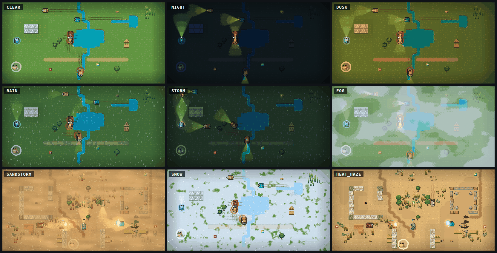

# Weather — the sky over the battlefield

A map's `weather` key puts a sky over it: `clear` (the default, and what
every older file gets), `night`, `dusk`, `rain`, `storm`, `fog`,
`sandstorm`, `snow` or `heat_haze`. Purely presentational, like
[the theme](desert-theme.md): the simulation, the nav grid, the linter and
the room server never read it, so a map plays the same under every sky and
a seeded replay, a probe fixture and a room's authoritative round are
untouched by it.

## The attribute

- **Map file**: a top-level `weather = "night"` (`map::Weather`, TOML
  `snake_case`). Absent means `clear`, and clear is not written back, so an
  editor re-save of an older map is byte-identical. An unknown name is a
  parse error, not a fallback.
- **Builder**: the MAP panel's WEATHER row cycles `Weather::ALL`, one undo
  step per press like every other settings field. The canvas stays clear,
  since a map is edited in daylight; PLAY starts the round under the sky.
- **Over every map**: the `weather_override` knob (`weather` tuning group)
  takes a weather's index in `Weather::ALL`, `-1` following the map.
  `--weather night` stages it at startup the way `--zoom` stages
  `view_max_scale`, the web build reads `?weather=night` off its page
  (`weather::weather_from_url`, through `window.bbInvite`), and on a PR
  preview it is a row in the tuning panel. The builder's row shows `(cli)`
  while it is set.
- **Dev server**: `weather` reports what is drawn (`in_force`), the map's
  own key, the override's pick and every name, and with `name` sets the
  round's map key at the frame boundary; `status.weather`, `map.weather`,
  `builder_settings {weather}` (null = clear) and `map_get`/`restart
  {map_toml}` carry it too.
- **Online**: the key rides the map TOML every `Welcome` carries, so every
  replica draws the room's sky with nothing new on the wire.
  `PROTOCOL_VERSION` is unchanged. The override knob is the window's own.

## The skies

Each weather is a `weather::Look`: the ambient light the field is
multiplied by, how strongly the round's lights show, and the amount of
each layer. `Look::of` resolves it from the table below and the `weather`
group's knobs; `weather_strength` eases the light toward daylight and
thins every layer together, 0 drawing every sky clear.

| Sky | Ambient light | Lights | Layers |
| --- | --- | --- | --- |
| clear | daylight | none | none - pass 1 runs exactly as it always has |
| night | moonlight: `night_ambient` (0.2) times a blue tint | full | vignette |
| dusk | warm (0.80, 0.62, 0.54) with the low sun rising toward the west edge | 0.6 | vignette |
| rain | grey (0.76, 0.80, 0.90) | 0.4 | rain 0.7 |
| storm | gloom, about twice the night's | full | rain 1.0, lightning |
| fog | pale (0.93, 0.95, 0.99) | 0.25 | fog 0.85 |
| sandstorm | orange (1.0, 0.87, 0.70) | 0.35 | sand 0.9 |
| snow | cold white (0.98, 1.0, 1.06) | 0.15 | snow 0.85 |
| heat_haze | hot (1.08, 1.0, 0.86) | none | haze 1.0 |

`Look::plan` says which of the renderer's stages a look needs; a look
whose light is daylight, with no lamps and no layer, is `None` and costs
nothing.

## How a weathered frame is drawn

`render/weather.rs` runs around pass 1 of `Game::render`:

1. **The light map** (a field-sized target): cleared to the ambient, then
   every light of `weather::lights` added in. Stored halved, so a pixel
   can be lit to twice daylight.
2. **The ground pass** (`static/weather_ground.fs`): the bare ground
   tileset (`Game::paint_ground`, into its own target) drawn onto the
   field with the sky's mark on it - snow cover in three steps, ice over
   the water, wet earth, puddles on the road cells, splashes and rings on
   the water. Water is the cell mask's word and the pixel's own blue
   together, so a shore's grass in a water cell is ground. Everything else
   on the floor - tread marks, scorches, rubble, oil, portals
   (`Game::paint_floor_marks`) - lies over it, so a tank leaves dark
   tracks in the snow, and the walls and hulls drawn later stay dry.
3. **The field under the light**: the tiles, their glows and everything
   standing (`paint_field_lit`).
4. **The light pass** (`static/weather_light.fs`): that field multiplied
   by the light map on the 2 px block grid, the colour fading toward a
   blue-grey where it is dark and the edges darkened by the look's
   vignette. Then what shines by its own light is drawn over it
   (`paint_field_glowing`): the locate labels, the shots and their light,
   the hits, flames and flares, the blasts, whatever is in the air and
   the particles - as bright at night as at noon. The daylight's glow
   pools under the shots are scaled down by the look's `lights`, since
   the light map already lights the ground around every shot.
5. **The sky pass** (`static/weather_sky.fs`): the air over everything -
   heat haze shifting rows by whole 2 px blocks, fog banks and blowing
   sand (both thinned within `weather_clear_radius_px` of every seat),
   rain in three depths, snow in three depths, and the white of a
   lightning strike. Fog, sand, rain and snow are lit by the light map, so
   at night a headlight's beam shows in the fog and the rain glitters
   where a fire burns.

The stages ping-pong between `scene_target` and the weather's own target
and always end in `scene_target`: under light and sky the field starts in
`scene_target`, is lit into the weather's target and comes back through
the sky; under one of the two it starts in the weather's target. Pass 2,
the ripple re-blits and the dev server's screenshots read `scene_target`
as they always have.

Every banding - the light, the fog, the sand, the snow cover - is stepped
with its edges dithered by a 2x2 Bayer pattern across the middle third of
each step (`band` in the shaders), so a gradient reads as drawn bands with
pixel-art edges rather than as a halftone. `light_bands` 0 draws smooth
light; `light_dither` off steps it hard.

## Lights

`weather::lights` gathers every light the round throws, each already cast
against the walls:

- **Tanks**: a headlight cone ahead of every live hull
  (`headlight_length_px`, an enemy's four fifths as long, warm white for a
  seat and amber for an enemy), a lamp at the nose, and a glow in the
  seat's team colour (`hull_glow_radius_px`) so no tank is lost in the
  dark. A wreck burns until it is a dead hulk; a hull with afterburn glows.
- **The round's fires**: burning ground cells, burning tiles, lit fuses,
  fuel drums in the air.
- **Portals**, pulsing blue.
- **Blasts**, a big flash fading with the fireball's glow; a mushroom
  cloud's reaches half as far again.
- **Shots**: shells, bullets, plasma bolts, missiles, flame jets, laser
  beams along their length, muzzle and impact flashes, and every hit the
  particle layer is playing.
- **The frogs and the pickups**, faintly, in their own colours
  (`pickup_glow_strength`), so a lamp can find them.

**Shadows** come from `weather::Occluders`: the map's cells, marked where a
tile's `Material::blocks_light` (brick, iron and wood; glass lets light
through, props are too low and trees too open to throw a hard edge). A
light is drawn as a fan of rays, each walked across the grid until it
enters a blocking cell (an Amanatides-Woo walk, one step per cell) and
carried `light_wall_bleed_px` into it so the wall's near face is lit. The
cell a light stands in never stops it, so a burning wall lights its
neighbours. `light_shadows` off draws every ray to full reach. The fan is
drawn with a vertex colour per ring down each ray (`RINGS`), bright at the
source and falling off with distance, straight into raylib's batch.

**Lightning** (`weather::lightning`) is a pure function of the round
clock: a strike in most `lightning_gap_seconds` windows, a sharp flash and
a second flicker, lifting the light map's ambient toward daylight while it
lasts. A replica strikes when the room's round would, and a frozen round
holds its flash. A strike is a whole-screen flash, so `screen_fx_intensity`
(the knob that calms the kill flash and the camera shake) scales it too,
and 0 leaves the storm without one.

## Knobs

The `weather` tuning group, every row `Live`:

- `weather_override`, `weather_strength`, `weather_vignette`.
- Light: `night_ambient`, `light_bands`, `light_dither`, `light_shadows`,
  `light_wall_bleed_px`.
- Lamps: `headlight_length_px`, `headlight_half_angle_deg`,
  `headlight_strength`, `hull_glow_radius_px`, `hull_glow_strength`,
  `shot_light_strength`, `fire_light_radius_px`, `fire_light_strength`,
  `blast_light_radius_px`, `pickup_glow_strength`.
- Layers: `rain_density`, `rain_speed_px`, `rain_slant`,
  `rain_splash_rate`, `lightning_gap_seconds`, `lightning_strength`,
  `fog_density`, `fog_drift_speed`, `weather_clear_radius_px`,
  `sand_density`, `sand_wind_speed`, `snow_density`, `snow_cover`,
  `haze_amplitude_px`, `haze_speed`.

## What it costs

- Three field-sized RGBA8 targets (about 7 MB at 1088 x 544), made on the
  first weathered frame and re-made when the field changes size, and the
  cell mask, one texel per map cell, uploaded when it changes.
- Per frame: the light list and its raycasts on the CPU (a few thousand
  grid steps), the light fans (tens of thousands of vertices on a busy
  night), and up to four full-field shader blits.
- A clear sky makes no target and runs no blit.

The shaders' clock wraps every half hour (`CLOCK_WRAP_SECONDS`) and their
noise hashes wrapped lattice points, so a long round never outgrows a
float; the GLSL ES 100 twins ask for high precision where the GPU has it.
A driver that cannot compile the passes draws every sky clear, like the
shot shaders' fallback.

## Tests

- `weather::tests`: every sky but clear has a plan and strength 0 has
  none, the knobs scale their layer, the override outranks the map, the
  page URL names a weather, lightning is a pure function of the clock and
  strikes now and then, walls stop rays and glass does not, a cone fades
  across its edge, a hull's beam is cut short by the wall in front of it,
  and every light on a shipped map is finite and inside its radius.
- `map::toml_tests::weather_round_trips_and_defaults_to_clear`, the
  builder's settings test, the dev server's
  `weather_sets_the_rounds_sky_and_every_reader_reports_it`, and
  `text_tests` (every weather name fits its settings row in every
  language).
- The picture itself is checked the way every effect is: `just run-dev`,
  `tuning_set {patch: {weather_override: N}}`, `step`, `screenshot`.

## Not in yet

- **Gameplay**: a shorter `enemy_view_range` at night or in fog, grip lost
  in rain, frozen water a hull can cross, gusts in a sandstorm. Each is a
  knob of its own and a conscious `just probe-fixtures` re-baseline.
- **Thumbnails**: `mapshot` draws on the CPU canvas, which has no shaders,
  so a thumbnail shows its map under a clear sky.
- **A day passing**: dusk falling into night over a wave round.
- **Sound**: there is no audio yet; rain and thunder want it.
